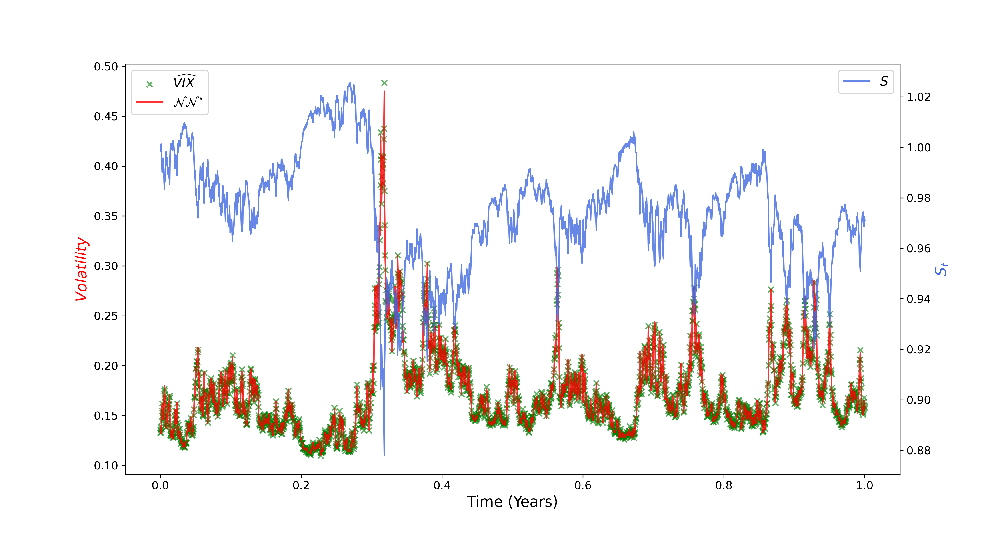

# pdv_nn

This is a collection of Python files and Jupyter notebooks used in the article:<br><br> <a href="https://arxiv.org/abs/2406.02319">
"Pricing and calibration in the 4-factor path-dependent volatility model"</a> <br><br>
of <a href ="https://homepage.univie.ac.at/guido.gazzani/">Guido Gazzani</a> and <a href ="https://cermics.enpc.fr/~guyon/">Julien Guyon</a>.


For citations:\
**MDPI and ACS Style**\
Gazzani, Guido and Guyon, Julien, "Pricing and calibration in the 4-factor path-dependent volatility model", 2024.
```
@article{GG:24,
      title={{Pricing and calibration in the 4-factor path-dependent volatility model}}, 
      author={Gazzani, Guido and Guyon, Julien},
      journal={Preprint arXiv:2406.02319},
      year={2024}}
```


